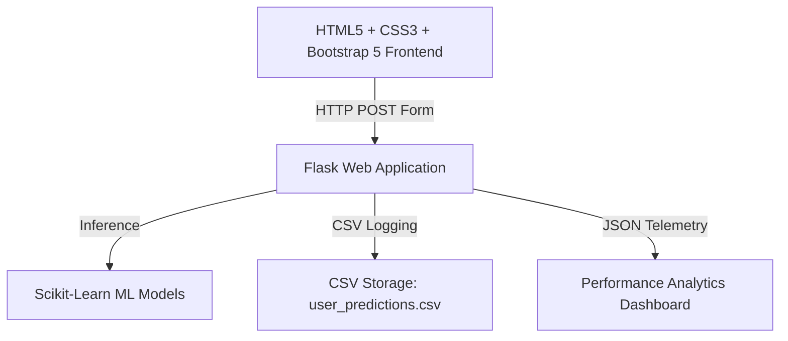

# 🌾 OptiCrop – Smart Agricultural Production Optimization Engine

OptiCrop is an intelligent, machine learning-powered agricultural decision engine designed to help agronomists, farmers, and agribusinesses optimize crop production. By analyzing soil chemical metrics (NPK) and climate telemetry (temperature, moisture, pH, rainfall), OptiCrop predicts the most suitable crops, estimates yields, categorizes soil clusters, and suggests specific soil replenishment treatments.

---

## 🏛️ System Architecture Topology

The application integrates machine learning pipelines with an elegant Flask web backend and a glassmorphic dashboard:



* **Frontend**: Responsive HTML5, Bootstrap 5, Bootstrap Icons, custom glassmorphism styling, and a global looping agricultural video background.
* **Backend**: Flask web framework, modular endpoints, Jinja2 templating, and custom session authentication gates.
* **Machine Learning Engine**:
  * **Classifier Models**: K-Nearest Neighbors (KNN), Logistic Regression, Decision Tree, and Random Forest (Winning model selected for prediction).
  * **Soil Clustering**: K-Means Clustering for soil cluster mapping.
  * **Yield Forecasting**: Random Forest Regressor for crop productivity estimation.
  * **Pipelines**: StandardScaler and LabelEncoder preprocessing.
* **Data Logging**: Custom CSV persistence (`datasets/user_predictions.csv`) tracking all queries and model inferences.

---

## ✨ Key Features & User Interface Upgrades

* **🔒 Split-Panel Security Gate**: A modern, split-screen authentication screen with a demo credentials card, custom farmer graphics, and standard glowing abstract orb details.
* **🎥 Ambient Background Video**: A looping, high-quality agricultural video running globally in the page background under a semi-transparent frosted-glass overlay.
* **⚡ Quick Crop Presets**: Instant form autofill chips for standard crop profiles (**Rice**, **Maize**, and **Watermelon**).
* **🎨 Clean Form Inputs**: Removed default selected choices and example placeholders, enabling a completely clean, user-friendly initial form entry.

---

## ⚙️ Quick Start Installation Guide

### Local Virtual Environment Setup

#### 1. Set Up Python & Virtual Environment
Ensure you have Python 3.10+ installed. In your terminal, run:

```bash
# Create virtual environment
python -m venv .venv

# Activate virtual environment
# On Windows (PowerShell):
.venv\Scripts\Activate.ps1
# On macOS/Linux:
source .venv/bin/activate
```

#### 2. Install Dependencies
```bash
pip install -r requirements.txt
```

#### 3. Run Dataset Generation & Model Training Pipeline
Train all models, compile metrics, and generate evaluation plots under static assets:

```bash
# 1. Generate synthetic soil and yield datasets
python generate_datasets.py

# 2. Train and evaluate all machine learning models
python train_models.py
```

This creates:
* Pickled model files under `models/` (`best_model.pkl`, `scaler.pkl`, `kmeans_model.pkl`, etc.).
* Model evaluation plots under `static/images/` (`model_comparison.png`, `confusion_matrix.png`, etc.).

#### 4. Run Flask Web Application
```bash
python app.py
```
Open your browser and navigate to `http://localhost:5000` to access the OptiCrop Optimizer.

---

## 🧪 Running Automated Unit Tests

Verify Flask routing, ML predictions, CSV storage, and API health:

```bash
# Execute unit tests with pytest
python -m pytest tests/
```

---

## 📁 Repository Directory Structure

```
SmartBridge/
├── datasets/                # Agricultural CSV datasets and predictions log
│   ├── crop_recommendation_dataset.csv
│   ├── crop_yield_dataset.csv
│   └── user_predictions.csv
├── models/                  # Serialized pickle (.pkl) model artifacts
│   ├── best_model.pkl
│   ├── kmeans_model.pkl
│   ├── label_encoder.pkl
│   ├── metadata.pkl
│   ├── scaler.pkl
│   ├── yield_encoders.pkl
│   └── yield_model.pkl
├── static/                  # Static assets (CSS, images, visual plots)
│   ├── css/
│   │   └── style.css
│   └── images/
│       ├── Smart.png             # Custom login page graphic
│       ├── confusion_matrix.png
│       ├── login_bg.mp4          # Premium background video asset
│       └── model_comparison.png
├── templates/               # Jinja2 HTML layout files
│   ├── ai_advisor.html
│   ├── dashboard.html
│   ├── index.html
│   ├── result.html
│   └── weather.html
├── tests/                   # Python test suite scripts
│   └── test_app.py
├── .gitignore               # Version control ignore specifications
├── app.py                   # Main Flask backend controller
├── generate_datasets.py     # Script to generate raw datasets
├── requirements.txt         # Project package requirements list
└── train_models.py          # Machine learning model training script
```
